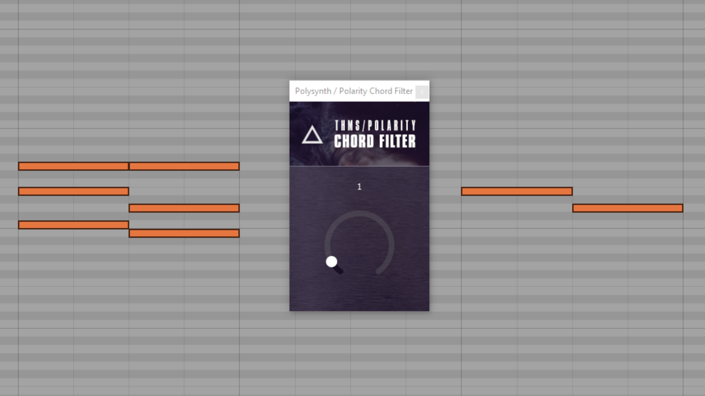

# Chord-Filter

**what it does:** filters notes from chords based on their position. Example: 1 always returns the 2nd note from the bottom. 0 always returns the lowest (root note). If there are only 3 notes but you select a 4, the top note is always returned.

**why:** i always wanted to have such a note filter and i only know the whole thing from plugins like cthulu, which combine it with other features. and since i like small and combinable plugins, the idea was obvious. I think it's also a good addition to the Bitwig device universe.

**what to use it for:** You can build big chord progressions and then send them to other instruments. There you can freely choose which note you want to use. E.g. only the bass or only the top line for the melody. Also interesting on a single track to build arpegios. I will surely make a video with some examples of use.

**status:** beta test. The plugin is very simple but still quite useful. And we are trying to get it to run smoothly on all systems first, so that we have a working basis for further plugins. You can also open [issues](https://github.com/POTR-Soft/Chord-Filter/issues) if you want, report bugs or feature requests.

- [Download Win/OSX/Linux Binraries](https://github.com/POTR-Soft/Chord-Filter/releases)
